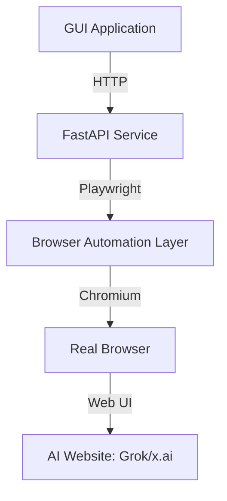
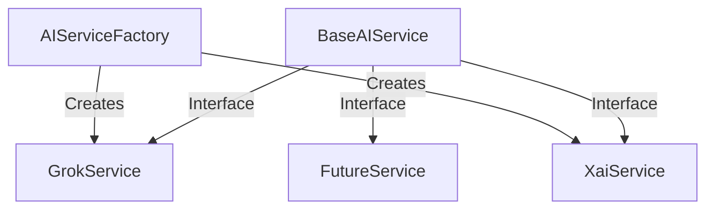
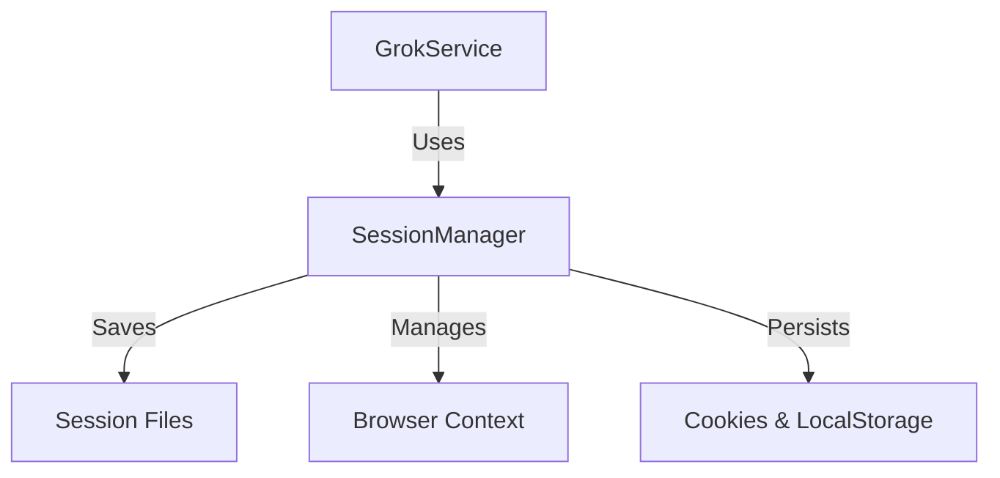
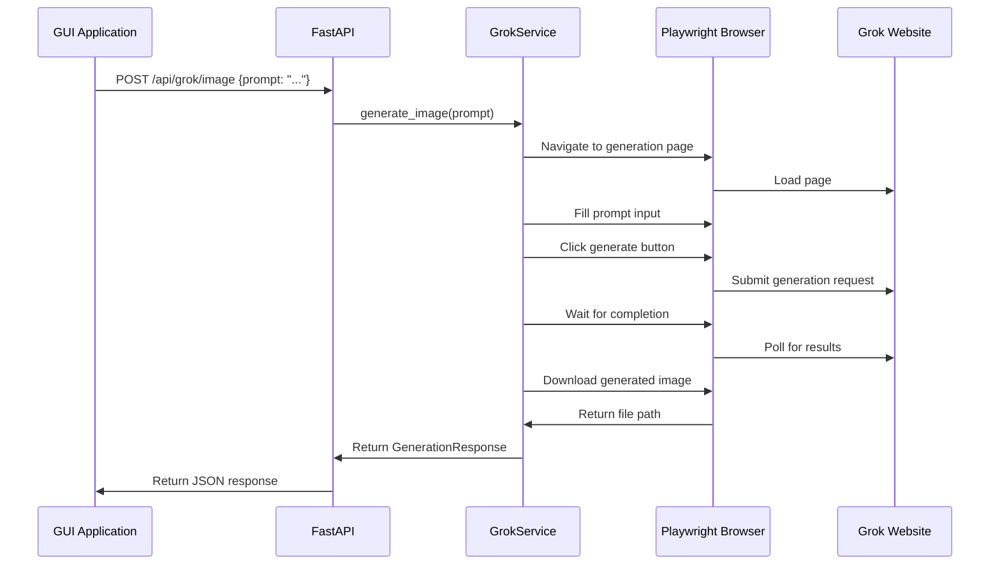
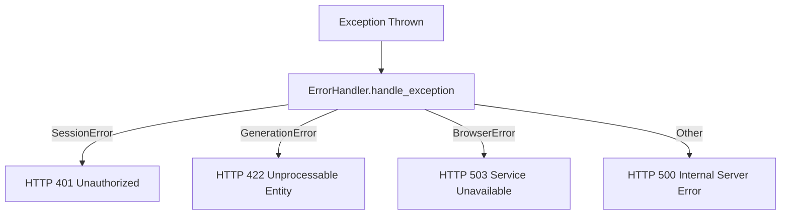
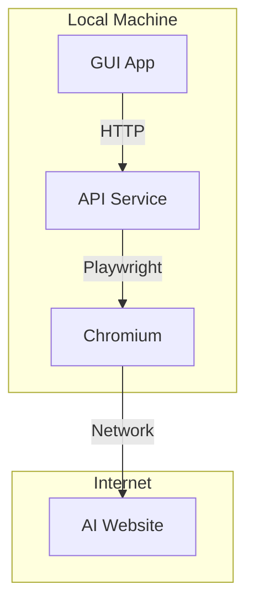

# AI Browser Automation API - Architecture Documentation

## Overview

This document describes the architecture of the AI Browser Automation API service, which provides programmatic access to AI generation capabilities through browser automation.

## System Architecture

## Core Components

### 1. API Layer (FastAPI)

**Location**: `api/routers/`

**Responsibilities**:
- HTTP endpoint definitions
- Request/response handling
- Input validation
- Error handling and HTTP status codes

**Key Endpoints**:
- `POST /api/grok/image` - Image generation
- `POST /api/grok/video` - Video generation  
- `POST /api/session/login` - Session management
- `GET /api/session/status` - Session status

### 2. Service Layer

**Location**: `services/`

**Responsibilities**:
- Business logic implementation
- Browser automation workflows
- Session management
- File handling and storage

**Key Services**:
- `GrokService` - Grok-specific automation
- `SessionManager` - Login state persistence
- `AIServiceFactory` - Adapter pattern for multiple AI sites

### 3. Browser Automation Layer (Playwright)

**Location**: Integrated throughout services

**Responsibilities**:
- Real browser control (non-headless)
- Page navigation and interaction
- Element waiting and detection
- Human-like behavior simulation
- Content downloading

### 4. Configuration & Utilities

**Location**: `config.py`, `utils/`

**Responsibilities**:
- Environment configuration
- Error handling
- Browser utilities
- Logging

## Design Patterns

### 1. Adapter Pattern

The adapter pattern allows easy integration of new AI websites by implementing the `BaseAIService` interface.

### 2. Session Management

Session persistence allows reusing login states across API calls.

## Data Flow

### Image Generation Flow

## Error Handling Strategy

## Anti-Detection Measures

1. **Non-headless browsers**: Real Chromium browsers with GUI
2. **Human-like delays**: Randomized typing and clicking delays
3. **Natural scrolling**: Simulated page scrolling behavior
4. **Session persistence**: Reuse authenticated browser contexts
5. **Low concurrency**: Single session per user

## Extensibility Points

### Adding New AI Websites

1. Create new service class implementing `BaseAIService`
2. Add selectors and workflows for the specific website
3. Register in `AIServiceFactory`
4. Add configuration to `config.py`

### Adding New Content Types

1. Add new generation method to service interface
2. Implement content-specific download logic
3. Add new API endpoint
4. Update response models

## Performance Considerations

- **Browser reuse**: Persistent contexts reduce startup time
- **Session caching**: Avoid repeated logins
- **Timeout management**: Configurable timeouts for different operations
- **Resource cleanup**: Proper browser context disposal

## Security Considerations

- **Session isolation**: Separate browser contexts per user
- **Credential handling**: Secure storage of login credentials
- **Input validation**: Sanitize all API inputs
- **Rate limiting**: Prevent abuse of the API

## Deployment Architecture

## Future Evolution Path

### MVP → V1.0
- Basic image generation
- Manual login flow
- Single AI website support

### V1.0 → V2.0
- Multiple AI website support
- Automated session recovery
- Generation queue management
- Progress tracking

### V2.0 → V3.0
- Distributed task processing
- Load balancing
- Advanced anti-detection
- Webhook notifications

## Key Technical Risks & Mitigations

| Risk | Mitigation |
|------|------------|
| Website UI changes | Modular selector system with fallbacks |
| Anti-bot detection | Human-like behavior simulation |
| Browser crashes | Automatic session recovery |
| Generation timeouts | Configurable timeout handling |
| Login failures | Session validation and re-authentication |

## Monitoring & Observability

- **Logging**: Comprehensive operation logging
- **Metrics**: Generation success rates and timings
- **Health checks**: Browser and session status endpoints
- **Error tracking**: Detailed error reporting

## Configuration Management

- Environment variables via `.env` file
- Runtime configuration validation
- Default values for all settings
- Type-safe configuration with Pydantic

This architecture provides a robust foundation for browser-based AI automation that can be extended to support multiple AI websites while maintaining stability and reliability.